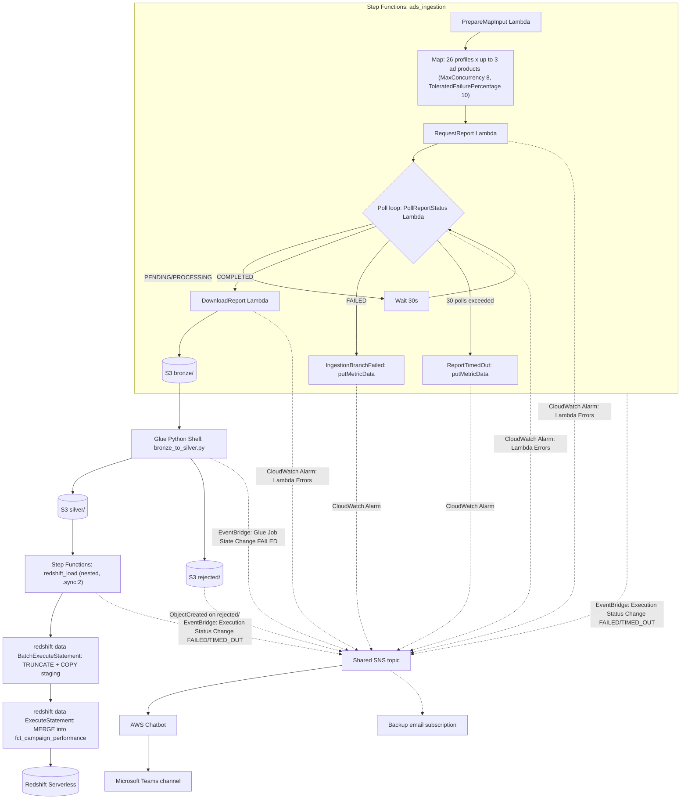

# AD Platform Pipeline — Amazon Ads Data Pipeline

**Status: Planning / boilerplate** — this repo documents the target architecture and contains
working connector/orchestration/validation code plus a deployable IaC template (`template.yaml`),
but nothing has actually been deployed to an AWS account yet. See [Open Questions](#open-questions)
before treating any of this as production-ready.

Ingests Sponsored Products / Sponsored Brands / Sponsored Display reporting data from **26
independent Amazon Ads advertiser profiles** (26 separate OAuth grants — these accounts are not
consolidated under one Manager Account) into a medallion S3 lake, validates it, and loads curated
campaign-performance data into **Redshift Serverless**. Entirely AWS-native, unlike this team's
other reference pipeline ([POS Pipeline](../POS%20Pipeline), which ends in BigQuery) — no cross-cloud
hop anywhere in this one.

## Architecture



## Repo Layout

```
common/             secrets.py, s3_paths.py, scheduling.py, logging_config.py
connectors/         base.py (retry/backoff, abstract connector), ads_connector.py (Sponsored Ads v3)
lambda_handlers/    prepare_map_input, report_requester, report_poller, report_downloader
statemachine/       ads_ingestion.asl.json, redshift_load.asl.json
glue_jobs/          bronze_to_silver.py
validation/         rules.py
redshift/           create_tables.sql, merge_fct_campaign_performance.sql,
                    scd2_dim_campaign_close.sql, scd2_dim_campaign_insert.sql, scd2_dim_profile.sql
infra/              configure_bucket_security.py, configure_rejected_lifecycle.py, configure_alerting.py, deploy.py
template.yaml       AWS SAM template -- Lambdas, Glue job, both state machines, their IAM roles
config/             profiles.example.yaml
tests/              test_validation_rules.py (unit), test_lambda_integration.py (integration)
.github/workflows/  ci.yml (lint + ASL JSON validation + sam validate --lint + pytest),
                    deploy.yml (manual workflow_dispatch CD, gated by a GitHub Environment)
```

## Why This Looks the Way It Does

Two research passes shaped the design before any code was written:

1. **API choice.** Amazon's Sponsored Ads v3 reporting API sunsets **December 31, 2026**. A newer
   "unified" reporting API GA'd on the Ads Console UI side in mid-2026, but **the Reporting API
   itself is still in open beta** — Amazon explicitly advises against production use of it today.
   Building against the beta contract now risks undocumented schema/rate-limit changes; building
   against v3 means a migration is due before end of 2026 regardless. **Decision: build
   `connectors/ads_connector.py` against v3 now** (stable, documented), but keep the interface
   (`connectors/base.py`'s `create_report`/`poll_report` abstract methods) generic enough that
   swapping in a unified-API connector later is a connector-layer change, not a pipeline rewrite.
2. **Attribution lookback is real.** Sponsored Ads attribution windows run 7–14 days depending on
   ad product, with restatement checkpoints out to ~28 days. A naive "pull yesterday only" design
   would silently miss late-settling conversions. **Decision: every scheduled run re-pulls a
   rolling 30-day window** (`common/scheduling.py`), not just the prior day — see
   [Idempotency](#idempotency--the-rolling-30-day-window) below.

## Design Decisions

| Layer | Choice | Rationale |
|---|---|---|
| Ingestion | Lambda (request/poll/download) driven by a Step Functions Map + Wait/Choice poll loop | Amazon Ads has no native AWS SDK integration (it's a third-party REST API) — every step must be a Lambda Task, unlike the [POS Pipeline](../POS%20Pipeline)'s BigQuery Data Transfer Service "no custom code" load |
| Fan-out | Map state over 26 profiles × up to 3 ad products (≤78 branches), `MaxConcurrency: 8`, `ToleratedFailurePercentage: 10` | Respects per-account (per-refresh-token) throttling; worst case ~2,000–4,700 state transitions per run, well under Standard Step Functions' 25,000-event history ceiling |
| Bronze | S3, partitioned `bronze/ad_product=/profile_id=/year=/month=/day=/`, unmodified gunzipped NDJSON as returned by the API | Same medallion/replayable principle as the POS reference — raw vendor payload, never mutated in place |
| Report download | `connectors/base.py`'s `download_and_stream_report` decompresses in a single streaming pass and flushes buffered rows to S3 every `FLUSH_ROW_THRESHOLD` (50k) rows, rather than buffering an entire report as parsed Python objects before writing anything | Bounds peak Lambda memory to one flush-batch, independent of how large any single profile/ad_product's report gets — each report already spans the full 30-day rolling window (see Idempotency below), and parsed JSON typically runs several times larger in memory than the equivalent raw text. A day's rows can end up split across more than one part (`common/s3_paths.object_key`'s `part` argument) — harmless, since Glue lists bronze by prefix, not by an assumed single file per day |
| Validation | Glue Python Shell (`glue_jobs/bronze_to_silver.py`), not Spark | Same boto3-loop pattern as the POS reference; this pipeline's volume (26 profiles × ≤3 ad products × daily campaign-level aggregates, no per-click rows) is well under Spark territory |
| Idempotency | Rolling 30-day window anchored on the EventBridge scheduled event's fixed `time` field (`common/scheduling.py`), not wall-clock `datetime.now()`; S3 keys carry `report_date`, so a rerun overwrites the same object rather than duplicating | Attribution lookback means yesterday-only pulls miss late conversions; re-pulling 30 days and re-`MERGE`-ing lets revised historical rows update in place instead of accumulating duplicates |
| Orchestration | Two Step Functions state machines: `ads_ingestion` and `redshift_load` (invoked nested via `.sync:2`) | Serverless, pay-per-transition, same reasoning as the POS reference |
| Curated warehouse | Redshift Serverless | User-selected; near-zero idle cost, fully AWS-native, native `MERGE` support removes the need for manual staging-diff logic |
| Curated load | `redshift-data:BatchExecuteStatement`/`ExecuteStatement` via direct Step Functions SDK integration, wrapped in a hand-built `Wait`/`DescribeStatement` poll loop | No `.sync` variant exists for the Redshift Data API (confirmed) — still "no Lambda/Glue script" for the SQL itself, just ASL + native SDK Task states |
| Dimension history | Hand-rolled SCD Type 2 SQL (`redshift/scd2_dim_campaign_close.sql`/`scd2_dim_campaign_insert.sql`, `redshift/scd2_dim_profile.sql`), not dbt | Only two slowly-changing dimensions exist (`dim_campaign`, `dim_profile`), each a two-statement close-then-insert pattern — not enough surface to justify standing up a new framework (dbt project, adapter, and a compute environment to run it in, since dbt can't execute inside Redshift itself) when plain SQL runs as one more `redshift-data` task in the existing state machine, no new service or IAM role required. Revisit if the number of SCD2 dimensions grows enough to want dbt's snapshot macro, tests, and lineage docs across all of them |
| Fact history | `fct_campaign_performance_history`, a companion table populated by a change-detecting SCD Type 2 close+insert (`redshift/scd2_fct_campaign_performance_close.sql`/`scd2_fct_campaign_performance_insert.sql`), run as the `ScdFctCampaignPerformanceHistory` task in `redshift_load.asl.json` right before `MergeIntoFact` | Lets BI see how a campaign-day's KPIs (`impressions`, `clicks`, `cost`, etc.) were revised over time by later attribution-window re-pulls, without touching `fct_campaign_performance` itself or its existing queries — that table stays the fast, single-row-per-campaign-day "current truth" it always was. Change-detected (`IS DISTINCT FROM` across every measure) rather than versioned on every run, since staging reflects the full 30-day rolling window on every run and most re-pulled days haven't actually changed — see [Fact History](#fact-history-fct_campaign_performance_history) |
| Secrets | AWS Secrets Manager, one secret per authorizing account (up to 26), referenced via a `profile_id -> secret_name` mapping in `config/profiles.yaml` | Refresh tokens are rotatable OAuth material, more sensitive than the POS reference's static API keys — Secrets Manager (KMS-encrypted) is the hardened equivalent of the same *indirection* principle |
| Alerting | Shared SNS topic ← CloudWatch Alarms (Lambda `Errors`, custom `BranchFailureCount` metric) + EventBridge rules (Step Functions Execution Status Change, Glue Job State Change) + S3 Event Notification (`rejected/` `PUT`) → AWS Chatbot → Microsoft Teams, plus an email backup subscription | Same "native signal first, no custom bridge" philosophy as the POS reference — simpler here since there's no GCP leg to bridge across |
| Monitoring dashboard | `AWS::CloudWatch::Dashboard` (`template.yaml`'s `Dashboard` resource), not Amazon Managed Grafana or self-hosted Grafana | CloudWatch is the only metrics source here — no cross-account or cross-tool view to unify — so a plain dashboard costs a few dollars a month versus Managed Grafana's recurring per-user licensing, with no extra service to operate. Revisit if that stops being true |
| Security | SSE-KMS on the raw bucket, Block Public Access (all four settings), versioning, TLS-only bucket policy, CloudTrail data events, per-role least-privilege IAM (no wildcard resource ARNs) | The POS reference explicitly flags this layer as thin ("needs hardening before production"); this pipeline builds it in from the start since the user asked for "similar security" as a first-class goal, not a deferred TODO |
| Logging | Standardized on Python `logging` with structured JSON output (`common/logging_config.py`) everywhere — connectors, Lambda handlers, the Glue job | The POS reference is inconsistent (mostly `print()`, one file uses `logging`); the one pattern worth carrying over exactly is its Teams-notifier's secret-hygiene discipline — never let credential-bearing exception text reach CloudWatch Logs (see `common/secrets.py`) |
| Retries | Two independent layers: `connectors/base.py`'s `_request` retries Ads API HTTP calls (429/5xx, honors `Retry-After`) *inside* a single Lambda invocation; every Task state in both `.asl.json` files additionally has a `Retry` block for the AWS-side transient errors specific to its own SDK integration (`Lambda.ServiceException`/`TooManyRequestsException` for `lambda:invoke`, `Glue.ConcurrentRunsExceededException` for `glue:startJobRun.sync`, `RedshiftData.ThrottlingException` for the Redshift Data API tasks, `StepFunctions.ExecutionLimitExceeded` for the nested state machine call) | These are different failure domains — the app-level retry can't see a Lambda that got throttled before the Ads API call even happened, and vice versa a `Retry` block can't see an HTTP 429 already handled inside the function. Deliberately scoped to each integration's own transient/throttling errors rather than a blanket `States.ALL` retry, so a real bug (bad SQL, a persistent Ads API failure) still fails fast into the existing `Catch` path instead of being masked by blind retries |
| Testing | `tests/test_validation_rules.py` (narrow unit tests) plus `tests/test_lambda_integration.py` (`pytest` + `moto`-mocked Secrets Manager/S3, `requests` monkeypatched for the LWA token endpoint and Sponsored Ads API) driving `report_requester` → `report_poller` → `report_downloader` → `prepare_map_input` in-process | Catches cross-module wiring bugs (e.g. a field name mismatch between what one handler returns and the next reads) that narrow unit tests can't, without needing Docker or a real AWS account. Deliberately *not* a `sam local invoke` test of the built artifact — `connectors/ads_connector.py`'s `REGION_HOSTS` is hardcoded per region, not env-var-overridable, so redirecting real Ads API calls into a container-local stub isn't feasible without an app code change |
| CI | GitHub Actions (`.github/workflows/ci.yml`): `ruff` lint, JSON-parse validation of every `.asl.json`, `sam validate --lint`, `pytest` | Runs on every push/PR to `main` |
| Disaster recovery | S3 versioning + a `NoncurrentVersionExpiration` lifecycle rule (`infra/configure_bucket_security.py`) on the raw bucket; a scheduled Redshift Serverless snapshot (`infra/configure_redshift_backup.py`) with retention just past `LOOKBACK_DAYS` | No cross-region replication/snapshot copy — that's the one piece that adds real cost (duplicate storage + transfer), and this pipeline hasn't been asked to survive a full region outage. Restoring a namespace from the latest snapshot needs no custom point-in-time replay: the next scheduled run's rolling window and its `MERGE` re-pull and reconcile anything since the snapshot on their own. See [Disaster Recovery](#disaster-recovery) |
| IaC / CD | AWS SAM (`template.yaml`) for compute + orchestration (Lambdas, Glue job, both state machines, their IAM roles); `.github/workflows/deploy.yml` runs it via manual `workflow_dispatch` behind a GitHub Environment approval, not automatically on merge | Stateful resources (raw bucket, KMS key, Redshift workgroup, Secrets Manager entries) are deliberately *not* template-managed — see [Deploying (AWS SAM)](#deploying-aws-sam) — and a data pipeline's deploy is riskier to auto-trigger than a stateless service's, so it stays a manual, reviewed action |

## Idempotency: the Rolling 30-Day Window

`lambda_handlers/prepare_map_input.py` computes `[start_date, until_date]` via
`common/scheduling.py:scheduled_window()`, anchored on the EventBridge scheduled event's `time`
field (falls back to `datetime.now(timezone.utc)` only when invoked outside a scheduled context —
explicitly **not** retry-safe in that fallback path, since a retried invocation would compute a
different "now").

Each date in the window becomes its own S3 object
(`bronze/ad_product=.../profile_id=.../year=/month=/day=/report_<id>.json`, keyed by the **report's
`report_date`**, not by wall-clock write time). A rerun of the same day's data overwrites the same
key rather than creating a duplicate. `glue_jobs/bronze_to_silver.py` mirrors that discipline
into `silver/`/`rejected/` via `common/s3_paths.swap_zone()` — the single sanctioned way to derive
a silver/rejected key from a bronze key, rather than an ad hoc string `.replace()` (a shortcut the
POS reference's own retrospective flagged as a discipline gap worth avoiding here from day one).

Because `silver/` is idempotently overwritten per `report_date` rather than appended to, it always
holds the full known-truth history. `redshift/create_tables.sql`'s `staging_campaign_performance`
is `TRUNCATE`d and reloaded from the **entire** `silver/` prefix on every run (not just the current
30-day window), and `redshift/merge_fct_campaign_performance.sql` upserts unconditionally on match
— there's no `updated_at` recency check like the POS reference's BigQuery merges use, because
staging isn't append-only here.

## Slowly Changing Dimensions (SCD Type 2)

`fct_campaign_performance` itself stays a plain upsert (see above) — BI querying "what's true
right now" for a campaign-day shouldn't have to filter down from multiple versions. Two dimension
attributes change independently of the measures and previously had **no** history at all: a
campaign's `campaign_name` (Amazon lets advertisers rename a live campaign) and a profile's
`account_name`/`marketplace`/`region` (an account can be renamed or reassigned). Both now carry
standard SCD Type 2 columns (`valid_from`, `valid_to`, `is_current`), maintained by hand-written SQL
rather than dbt — see the Design Decisions table above for why dbt didn't clear the bar for just
two dimensions. The same pattern, extended with change detection, is what tracks *measure* history
too — see [Fact History](#fact-history-fct_campaign_performance_history) below.

Each dim's upsert is two SQL statements run back-to-back, not a single Redshift `MERGE` — `MERGE`
can only express "update in place" or "insert new," not "close the old row and open a new one,"
which SCD Type 2 needs on every rename:

1. **Close**: `UPDATE ... SET is_current = FALSE, valid_to = CURRENT_DATE` on any `is_current` row
   whose tracked column(s) no longer match the source.
2. **Open**: `INSERT` a fresh `is_current = TRUE` row for any natural key with no open row left —
   either a brand-new campaign/profile, or one the close step just closed for a rename.

Because a `profile_id`/`campaign_id` can now appear on more than one `dim_profile`/`dim_campaign`
row over time, neither is a unique/primary key on those tables anymore, and
`fct_campaign_performance.profile_id` dropped its `REFERENCES dim_profile` FK accordingly (see
`redshift/create_tables.sql`'s comment). Join against **current** attributes via the
`dim_profile_current`/`dim_campaign_current` views (`WHERE is_current = TRUE`), not the base
tables directly.

- **`dim_campaign`** (`redshift/scd2_dim_campaign_close.sql` + `scd2_dim_campaign_insert.sql`, one
  file per statement — see [Deploying (AWS SAM)](#deploying-aws-sam) for why) runs automatically,
  as the `ScdDimCampaign` task in `statemachine/redshift_load.asl.json`, sourced from
  `staging_campaign_performance` — which is already refreshed from `silver/` on every run, so no
  new ingestion is needed.
- **`dim_profile`** (`redshift/scd2_dim_profile.sql`) stays a **manual** step, same as the existing
  "seed `dim_profile` from `config/profiles.yaml`" note on `create_tables.sql` — nothing in the
  automated pipeline currently loads `profiles.yaml` into Redshift. Re-populate `staging_profile`
  from the current `profiles.yaml` and run the script whenever an account is renamed, reassigned,
  or onboarded.

### Fact History (`fct_campaign_performance_history`)

`fct_campaign_performance` has no `updated_at`/version column — a same-day revision (e.g. Amazon's
attribution window pushing `sales_14d` up a few days after a click) simply overwrites the row in
place, by design (see the `MergeIntoFact` section above). That's fine for BI answering "what's true
now," but it means the *previous* value of a KPI is gone the moment a revision lands, with no way to
see how a specific campaign-day's numbers moved over time.

`fct_campaign_performance_history` is a companion table that keeps that trail, using the same
close-then-insert SCD Type 2 pattern as `dim_campaign`/`dim_profile` above, but keyed on the fact's
own grain (`profile_id`, `ad_product`, `campaign_id`, `report_date`) instead of a dimension's
natural key, and change-detecting on the measures themselves:

- **Close** (`redshift/scd2_fct_campaign_performance_close.sql`): closes the current history row
  for a campaign-day only if at least one measure (`impressions`, `clicks`, `cost`,
  `purchases_14d`, `sales_14d`) or `campaign_name` differs (`IS DISTINCT FROM`) from what staging
  now reports for it.
- **Insert** (`redshift/scd2_fct_campaign_performance_insert.sql`): opens a fresh
  `is_current = TRUE` row for any campaign-day with no open row — either its first-ever load, or
  one the close step just closed because of a revision.

This runs as the `ScdFctCampaignPerformanceHistory` task in `redshift_load.asl.json`, right after
`ScdDimCampaign` and right before `MergeIntoFact` — the old value has to be captured before
`MergeIntoFact` overwrites it. Change detection matters here specifically because
`staging_campaign_performance` is reloaded from the *entire* `silver/` zone (the full rolling
30-day window) on every run, not just newly-arrived days — an unconditional close+insert would
version a new (identical) history row for every unchanged campaign-day on every single run.

To see how a campaign's KPIs progressed for a given day, including every revision:

```sql
SELECT report_date, impressions, clicks, cost, sales_14d, valid_from, valid_to, is_current
FROM fct_campaign_performance_history
WHERE profile_id = '...' AND campaign_id = '...' AND report_date = '2026-06-15'
ORDER BY valid_from;
```

## Validation & Schema Drift Detection

`validation/rules.py` is a pure function library: `validate_record(record, ad_product)` returns a
failure reason string or `None` — no exceptions, no side effects, trivially unit-testable.
Required fields (`date`, `campaignId`, `impressions`, `clicks`, `cost`) are checked for
presence/non-emptiness, `date` gets an ISO-8601 format check, and the numeric fields get a
non-negative-number check. Records failing any check are written to `rejected/` tagged with
`_validation_error`; everything else goes to `silver/`.

**Schema drift is a separate concern from validity.** `detect_new_fields()` diffs each record's
keys against a `KNOWN_FIELDS` baseline per ad product — an unrecognized field doesn't reject the
record, it's a signal. `glue_jobs/bronze_to_silver.py` emits both as CloudWatch metrics in the
`AdsPipeline/Validation` namespace, dimensioned by `AdProduct`:

- `RejectedRatio` (Percent) — a **diagnostic severity signal**, not the alert trigger. Logged as a
  warning above 10%.
- `NewFieldCount` (Count) — logged as a warning whenever nonzero, so a real Amazon schema change
  gets noticed before it silently accumulates in `rejected/`.

## Alerting & Failure Notifications (Microsoft Teams)

One shared SNS topic (`infra/configure_alerting.py`), fed by every native AWS failure signal, with
AWS Chatbot forwarding to the team's Teams channel:

| Source | Signal | Destination |
|---|---|---|
| Step Functions (both state machines) | EventBridge rule: Execution Status Change = `FAILED`/`TIMED_OUT`/`ABORTED` | shared SNS topic |
| Glue (`bronze_to_silver`) | EventBridge rule: Glue Job State Change = `FAILED`/`TIMEOUT` | shared SNS topic |
| Lambda (all three handlers) | CloudWatch Alarm on the `Errors` metric, per function | shared SNS topic |
| Tolerated per-branch ingestion failures | CloudWatch Alarm on custom `AdsPipeline/Ingestion` `BranchFailureCount` metric | shared SNS topic |
| Rejected records | S3 Event Notification: `PUT` on the `rejected/` prefix — fires on any single rejected record, not a ratio threshold | shared SNS topic |

**Why `BranchFailureCount` exists as its own metric:** the ingestion Map state's
`ToleratedFailurePercentage: 10` means a single profile/ad-product branch failing does **not** fail
the overall Step Functions execution — by design, so one bad account doesn't take down the other
25. But that also means the Execution-Status-Change EventBridge rule alone would never see it. The
`ReportTimedOut`/`IngestionBranchFailed` branch states in `ads_ingestion.asl.json` each end with a
direct `putMetricData` SDK call precisely so this failure mode stays alertable.

Subscribe **AWS Chatbot** to the SNS topic (one-time OAuth authorization to the Teams channel, done
once in the Chatbot console — not scriptable, see `infra/configure_alerting.py`'s closing note).
Add an email subscription to the same topic as a free backup channel (`--email` flag).

### Monitoring Dashboard

Alarms above only fire once a metric crosses a threshold — there was previously no way to see
these metrics together and notice a trend *before* that happens. `template.yaml`'s `Dashboard`
resource (`AWS::CloudWatch::Dashboard`, name `ads-pipeline`) covers: Lambda `Errors` and p90
`Duration` for all four functions, `BranchFailureCount` and `RejectedRatio`/`NewFieldCount`
(via `SEARCH()` expressions scoped to their namespace, so a future 4th ad product doesn't require
editing the dashboard), and both state machines' execution outcomes. It's a plain CloudWatch
Dashboard rather than Amazon Managed Grafana or a self-hosted one — this pipeline has a single
metrics source (CloudWatch) and no cross-account/cross-tool view to unify, so a dashboard costs a
few dollars a month at most versus Managed Grafana's recurring per-user licensing, with no new
service to operate. Revisit if CloudWatch stops being the only metrics source. The console URL is
in the stack's `DashboardUrl` output.

## Data Validation

`MergeIntoFact` updates `fct_campaign_performance` unconditionally on match (no recency check —
see `redshift/merge_fct_campaign_performance.sql`'s header), so on a clean run
`staging_campaign_performance` (source — TRUNCATE+COPY'd from the full `silver/` zone every run)
and `fct_campaign_performance` (target), scoped to the date range staging covers, should come out
byte-for-byte equal on row count and every measure. A mismatch means the load silently lost or
duplicated rows somewhere between COPY and MERGE — not something a schema-drift or
rejected-record signal would ever catch, since both of those fire earlier in the pipeline, before
data reaches Redshift at all.

`redshift/reconciliation_check.sql` is a single aggregate query returning one row with a
`source_`/`target_` column pair per measure (`row_count`, `impressions`, `clicks`, `cost`,
`purchases_14d`, `sales_14d`). `lambda_handlers/reconciliation_check.py` runs it directly via the
Redshift Data API (`execute_statement`/`describe_statement`/`get_statement_result`), compares each
pair, and publishes a plain-text summary to the shared SNS alerts topic — **every run**, not just
on mismatch, so the team's Teams channel gets a standing "Reconciliation OK" confirmation as well
as a "Reconciliation MISMATCH" flag. This runs as the `ReconciliationCheck` task in
`statemachine/redshift_load.asl.json`, immediately after `IsMergeDone` confirms `FINISHED`.

A mismatch does not fail the state machine: `MergeIntoFact` already committed, so there's nothing
left to roll back at this point, and the point of this check is to surface it for a human to
investigate, the same way a CloudWatch alarm notifies without blocking whatever it's watching. A
dedicated Lambda (rather than a plain ASL `Choice` state) is necessary here because classic
Step Functions Choice states can only compare a field to a fixed literal, not two dynamic query
results against each other.

## Security

- **Encryption**: SSE-KMS (customer-managed key, not the S3-managed default) on the raw bucket,
  `BucketKeyEnabled` for cost efficiency (`infra/configure_bucket_security.py`).
- **Public access**: all four Block Public Access settings enabled.
- **Versioning**: enabled as a safety net against accidental overwrite (object keys are
  deterministic by design, so this is defense-in-depth, not the primary mechanism), paired with a
  `NoncurrentVersionExpiration` lifecycle rule (default 30 days) so versioning's storage cost stays
  bounded instead of keeping every routinely-overwritten prior version forever.
- **Transport**: bucket policy denies any non-TLS request (`aws:SecureTransport: false`).
- **Audit**: CloudTrail data events on the bucket's object-level API calls, when a trail name is
  provided.
- **Secrets**: refresh tokens live only in Secrets Manager, never in env vars or config
  (`config/profiles.yaml` stores only `secret_name` references). Access tokens are cached
  in-process with a 60-second expiry safety margin, never logged. `common/secrets.py` re-raises
  LWA failures with `from None` to strip any chained traceback that might carry token material.
- **IAM**: one role per function (defined in `template.yaml`) — report-requester, report-poller,
  report-downloader, prepare-map-input, glue-validator, the two state-machine execution roles, and
  the Redshift COPY role — each scoped to the specific S3 prefixes, secret paths, and CloudWatch
  namespaces that role actually needs. No wildcard resource ARNs, and none use the broad
  AWS-managed `AWSLambdaBasicExecutionRole` (it grants `logs:*` account/region-wide; these roles
  scope log permissions to each function's own log group instead).
- **Direct injection (bypassing the pipeline entirely)**: IAM least-privilege above only
  constrains what this pipeline's *own* roles can do — it says nothing about some other IAM
  principal in the account (an over-permissioned admin role, a compromised credential) writing
  straight into `bronze/`/`silver/`/`rejected/` or calling the Redshift Data API directly, skipping
  Glue's validation and landing fabricated rows in the fact table.
  - **S3**: `infra/configure_bucket_security.py --allowed-writer-role-arn` adds a bucket-policy
    `Deny` on `s3:PutObject` to those three prefixes for any principal other than
    `ReportDownloaderRole`/`GlueValidatorRole` — a resource-level backstop that holds even if IAM
    elsewhere in the account is looser than it should be.
  - **Detection**: `infra/configure_alerting.py --cloudtrail-log-group` adds a CloudWatch Logs
    metric filter + alarm over the CloudTrail log group, firing on any `PutObject` to those
    prefixes from outside the two allowed roles — so a denied (or, if the bucket policy above
    isn't deployed, a successful) unexpected write actually gets noticed, the same way the
    `rejected/` S3 notification turns a validation rejection into a visible alert. Requires
    CloudTrail already delivering to a CloudWatch Logs log group (not created by this script).
  - **Redshift**: there's no bucket-policy equivalent here — the Redshift Data API has no
    resource-based policy that can Deny by caller ARN independent of IAM. The only real control is
    keeping `redshift-data:ExecuteStatement`/`BatchExecuteStatement` out of every IAM policy in the
    account except `RedshiftLoadStateMachineRole` — an account-wide IAM-governance discipline (or
    an Organizations SCP), not something this template alone can enforce.

## Runbooks

### Handling Rejected Records

1. You'll be alerted via the S3 `rejected/` event notification (Teams, via Chatbot) — the alert
   fires on the first bad record, not after a ratio threshold, so triage promptly rather than
   waiting for a batch to accumulate.
2. Read the object at the `_validation_error`-tagged key to see the specific failure reason per
   record.
3. Cross-reference `NewFieldCount`/`RejectedRatio` in CloudWatch (`AdsPipeline/Validation`
   namespace) for the same `AdProduct` dimension around that time — a spike often means Amazon
   changed the report schema rather than a one-off bad record; if so, update
   `validation/rules.py`'s `KNOWN_FIELDS`/`REQUIRED_FIELDS`.
4. `rejected/` objects expire automatically after the retention window configured by
   `infra/configure_rejected_lifecycle.py` (default 90 days) — triage before then if the records
   need to inform a fix.

### A Report Is Stuck in `PENDING`

Amazon's own issue tracker documents reports that never transition out of `PENDING`/`PROCESSING`
with no confirmed root cause on Amazon's side. `ads_ingestion.asl.json`'s poll loop caps at 30
iterations (~15 minutes at the 30-second poll interval) before routing to `ReportTimedOut`, which
emits the `BranchFailureCount` metric and alerts via the path above. There is no automatic retry
of a timed-out report within the same execution — the next scheduled run's 30-day window will
naturally re-request that day's report.

### A Redshift Load Fails Mid-`MERGE`

`redshift_load.asl.json` catches `States.ALL` on every task and routes to `LoadFailed`, which
alerts via the Step Functions EventBridge rule. Because `staging_campaign_performance` is
`TRUNCATE`d and fully reloaded from `silver/` on every run (not incrementally), simply re-running
the nested state machine is safe — there's no partial-state cleanup needed first.

### Disaster Recovery

Two stores, two mechanisms:

- **Raw bucket (bronze/silver/rejected)**: versioning is already enabled
  (`infra/configure_bucket_security.py`), paired with a `NoncurrentVersionExpiration` lifecycle
  rule (default 30 days) so that safety net doesn't accumulate unbounded storage cost. This
  protects against an accidental overwrite/delete of an object, not a region-level loss of the
  bucket itself.
- **Redshift Serverless**: `infra/configure_redshift_backup.py` schedules a recurring snapshot
  (default daily, 35-day retention — just past `LOOKBACK_DAYS`) on top of Redshift Serverless'
  free, automatic ~24-hour recovery points, which aren't enough retention to recover from something
  noticed a few days later.

**Recovery procedure** if the Redshift namespace is lost or corrupted: restore from the latest
snapshot, then do nothing else — the next scheduled `ads_ingestion` run's rolling 30-day window
will re-pull and its `MERGE` will reconcile anything that changed between the snapshot and now,
the same way it reconciles any other attribution revision (see
[Idempotency: the Rolling 30-Day Window](#idempotency-the-rolling-30-day-window)). No point-in-time
replay tooling is needed because of that idempotency.

**Deliberately out of scope**: cross-region replication of the bucket and cross-region copy of
Redshift snapshots, which would be needed to survive a full AWS region outage. Both are real added
cost (duplicate storage in a second region, plus transfer) rather than the near-zero cost of the
pieces above — add them if surviving a full region outage becomes an actual requirement, not
preemptively.

## Deploying (AWS SAM)

`template.yaml` is an [AWS SAM](https://docs.aws.amazon.com/serverless-application-model/) template
that resolves every `${...}` placeholder token in the `.asl.json` files above via
`DefinitionSubstitutions`, and replaces the IAM policy JSON files this repo used to carry with
native `AWS::IAM::Role` resources.

**Scope boundary — what's template-managed vs. not.** The template owns compute and orchestration
only: the four Lambdas, the Glue job, both state machines, and their IAM roles. It deliberately
does **not** create the raw S3 bucket, its KMS key, the Redshift Serverless workgroup/namespace and
schema, or the per-profile Secrets Manager entries — those stay stateful resources provisioned once,
out of band, via `infra/configure_bucket_security.py`, `infra/configure_rejected_lifecycle.py`,
`infra/configure_alerting.py`, `infra/configure_redshift_backup.py`, and `redshift/create_tables.sql`,
and are passed into the template by
ARN/name via CloudFormation Parameters. The reasoning: a stack update that redeploys Lambda code or
tweaks a state machine definition should never be able to touch the data plane (the bucket's
contents, the warehouse, the secrets) as a side effect. `infra/configure_alerting.py`'s SNS
topic/EventBridge rules/CloudWatch alarms are left as-is for the same reason, plus its one
genuinely non-scriptable step (AWS Chatbot's Teams OAuth) already requires a manual pass.

**Why `scd2_dim_campaign.sql` became two files.** The `ScdDimCampaign` task uses
`redshiftdata:batchExecuteStatement`, whose `Sqls` parameter is a JSON array — each element needs
its own `DefinitionSubstitutions` token, so the close and insert statements live in
`scd2_dim_campaign_close.sql` / `scd2_dim_campaign_insert.sql` instead of one combined file.
`dim_profile`'s SCD2 script stays a single file, since it's a manual/operator-run step (see
[Slowly Changing Dimensions](#slowly-changing-dimensions-scd-type-2)) that never goes through this
substitution mechanism at all.

**Deploying:**

```
python infra/deploy.py \
    --stack-name ads-pipeline --region us-east-1 \
    --raw-bucket <existing-bucket> --kms-key-arn <existing-key-arn> \
    --deploy-artifacts-bucket <bucket-for-glue-script-upload> \
    --redshift-workgroup <workgroup> --redshift-database <database> \
    --ads-lwa-client-id <client-id> --alerts-topic-arn <existing-sns-topic-arn>
```

with `ADS_LWA_CLIENT_SECRET` set in the environment (never as a CLI flag). The script uploads
`glue_jobs/bronze_to_silver.py` and a zip of `common/`+`validation/` to
`s3://<deploy-artifacts-bucket>/glue/` (Glue Python Shell jobs have no CodeUri-style packaging the
way Lambda does), reads the three `redshift/*.sql` files above, then runs `sam build`/`sam deploy`
with all of it passed through `--parameter-overrides` — each value as its own `subprocess.run` argv
element, never through a shell, so the multi-line SQL text needs no escaping.

`.github/workflows/deploy.yml` runs the same script from CI, but only via manual
`workflow_dispatch` behind a GitHub Environment approval — see that file's header comment for why
this stays manual (nothing bootstrapped yet, and a data pipeline's deploy is riskier to auto-trigger
than a stateless service's) and exactly which secrets/variables that Environment needs configured
before it can run for the first time.

## Open Questions

- [ ] Confirm the unified reporting API's exact contract before any future migration off v3 (its
      docs site isn't reliably scrapable — pull the live OpenAPI/Postman spec from an
      authenticated Ads API console session once it exits beta).
- [ ] Confirm per-profile ad-product coverage — not all 26 profiles necessarily run all of
      SP/SB/SD. This affects `config/profiles.yaml`'s actual item list, not a fixed 26×3 = 78.
- [ ] Confirm Sponsored Brands v3 eligibility (`isMultiAdGroupsEnabled=false` legacy campaigns
      don't report correctly) across all 26 profiles before relying on `sbCampaigns` for every one.
- [ ] `Retry-After` is documented as sometimes absent specifically on `POST /reporting/reports` —
      verify `connectors/base.py`'s backoff fallback path is actually exercised in practice, not
      just in code.
- [ ] `COLUMNS_BY_AD_PRODUCT` in `connectors/ads_connector.py` was assembled from Amazon's v3
      migration guide, not verified against live sandbox data — confirm against a real report
      before production use.
- [ ] Nothing has actually been deployed yet — `template.yaml` is written and `sam validate --lint`
      passes in CI, but it's never been run against a real AWS account. The stateful prerequisites
      it assumes (raw bucket, KMS key, Redshift Serverless workgroup + schema, per-profile Secrets
      Manager entries) don't exist anywhere yet either — see
      [Deploying (AWS SAM)](#deploying-aws-sam).
- [ ] The `AdsLwaClientSecret` CloudFormation parameter is `NoEcho` but not encrypted at rest in
      the stack's parameter history — see that parameter's description in `template.yaml`. Fine for
      now (one rotatable, non-customer secret); worth revisiting if that changes.
- [ ] `deploy.yml`'s OIDC deploy role, and the GitHub Environment secrets/variables it reads, don't
      exist yet either — the workflow is real but can't run until both are created by hand.
